# Screen|Fixed
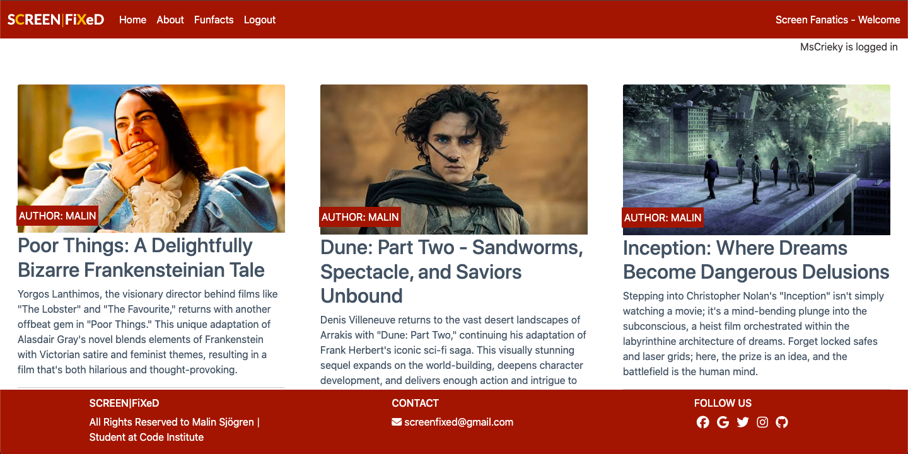

Welcome to Screen|Fixed: Your Informative Guide Through the World of Film and Television
Dive into Screen Fixed, your gateway to exploring the captivating world of movies and television shows. Whether you're a seasoned cinephile or a curious newcomer, this blog offers an insightful and informative haven to delve deeper into your favorite stories and discover hidden gems.

## USER EXPERIENCE (UX)

Immerse yourself in the enchanting world of everything on screen at Screen|Fixed, where every visit promises a seamless and captivating user experience. Explore the latest movie reviews, fascinating TV-series discussions, and intriguing fun facts with ease. Our blog features intuitive navigation, visually stunning content, and a hassle-free exploration of all things movies. Whether you're a seasoned cinephile or just starting your cinematic journey, Screen|Fiexed invites you to indulge in the magic of cinema and tv-series like never before.

### PROJECT GOAL

This will be a blog about the best new coming movies and series on streaming sites like Netflix, Disney + etc. Its purpose is to make it easier to find what is popular based on category, genre and views. This will make it easier for anyone who wants to find something good to watch in the wast jungle of choices out there.

### Agile Methodology

We utilized the Agile Methodology to effectively prioritize and organize tasks, including the creation of user stories and the utilization of Project Boards on GitHub. Additionally, a template was developed to streamline the process of crafting user stories.

* We drafted epics containing potential user stories, serving as the foundation for developing the website.
* User stories were derived from the epics and refined through iterative processes, driving the project forward.
* The Project Board is publicly accessible, providing transparency and insight into the project's progress.
* Utilizing the Project Board, tasks were tracked as they moved through the stages of Todo, In Progress, and Done.
* Labels were incorporated to categorize issues based on their level of importance, aiding in prioritization and organization.

 User Stories Template

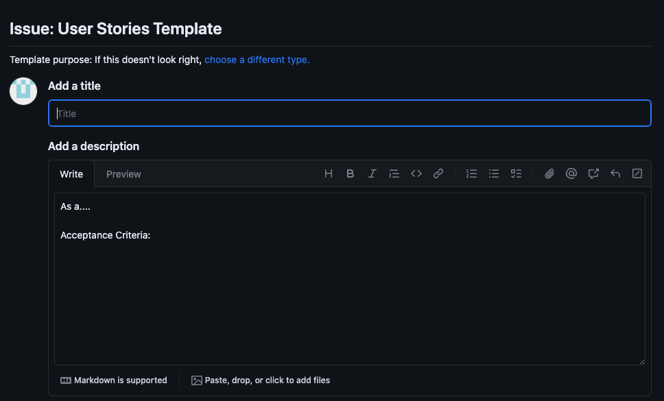

 User Stories - Issues

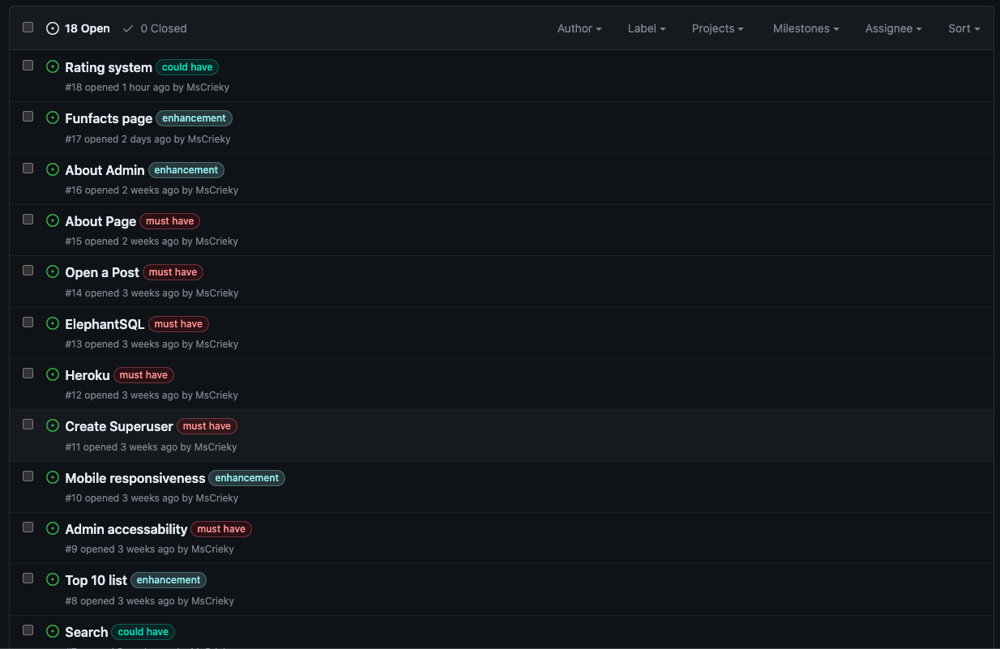

 Project Board

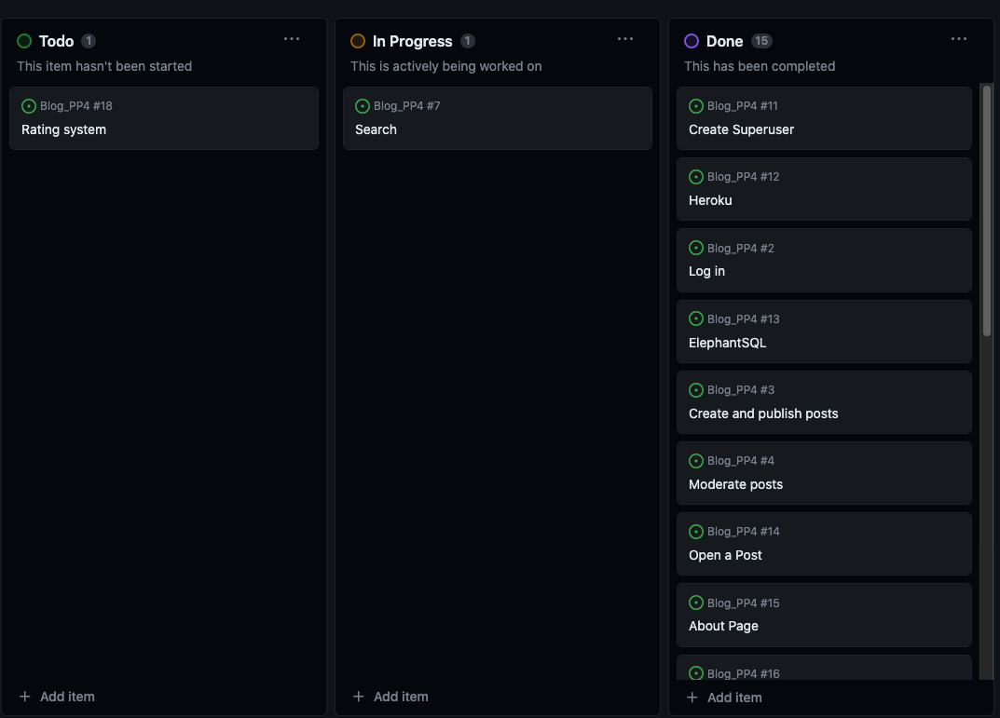

### User Stories

For user stories and acceptance criteria, please access here:
[project board](https://github.com/users/MsCrieky/projects/5/views/1)

### Target Audience

* People who love to watch movies and series
* Movie buffs and cinephiles
* People who are looking for recommendations for new movies to watch
* People who are interested in learning more about the film industry

### For first-time visitors

* Enjoy simple and intuitive website navigation, making exploration and discovery effortless.
* Immerse yourself in engaging visuals that highlight the beauty of our movie blog and its cinematic wonders.
* Fill out user-friendly forms with clear validation messages, ensuring accurate input and smooth interactions.
* Experience an easy registration process, welcoming you to our movie community with ease.

### For registered users

* Experience a seamless login process with a secure and personalized user account, ensuring easy access to all features.
* Browse available movies with ease, exploring a wide range of cinematic options.
* Enjoy access to a personalized dashboard showcasing curated posts and fun facts tailored to your interests.
* Easily modify or delete existing posts for flexibility and convenience, putting you in control of your content.

### For admin users

* Utilize a secure and separate login portal tailored for admin users, ensuring appropriate access control.
* Access an admin dashboard for efficient management of posts and comments.
* Enjoy the ability to add, edit, or delete fun facts and modify the about page as needed.
* Exercise control over user accounts by easily deleting accounts, facilitating efficient management of user data and accounts.

## Design

Indulge in a cinematic oasis with our elegantly designed movie blog. Immerse yourself in captivating visuals, seamless navigation, and a curated collection of film delights. Explore, discover, and embrace the magic of cinema in style.

### Typography

The 'Roboto' font is specified as the primary font, and the 'SansSerif' font is specified as a fallback font.

### Wireframes desktop / mobile view

 Home Page

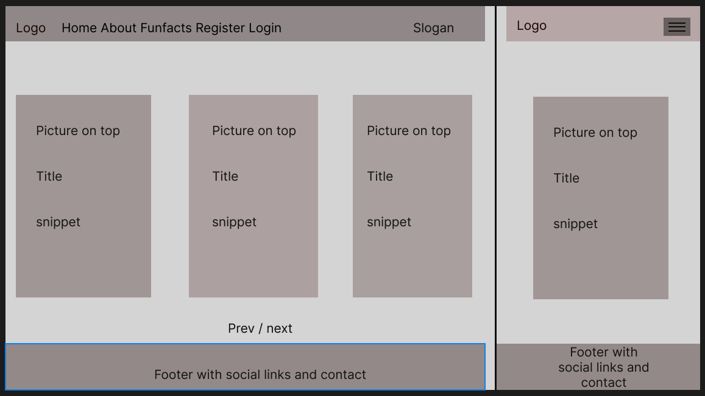

 About Page

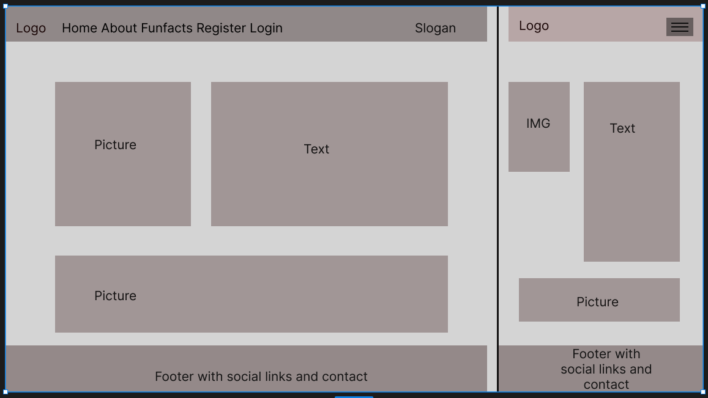

 Funfacts Page

 Sign In/Sign Up Page

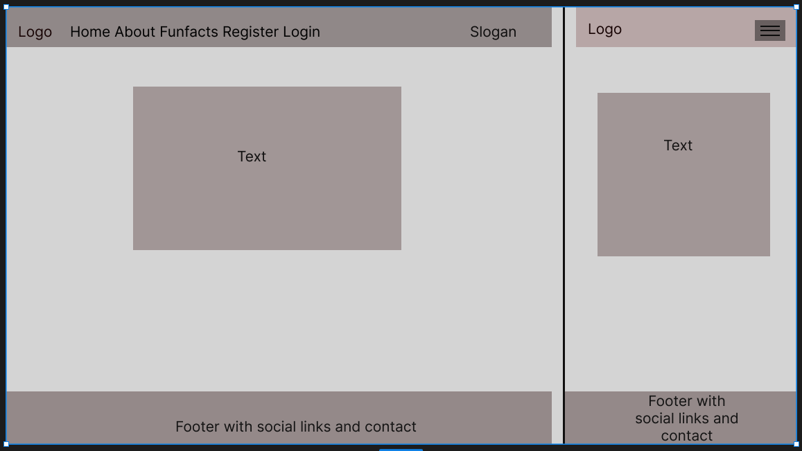

 LogOut Page

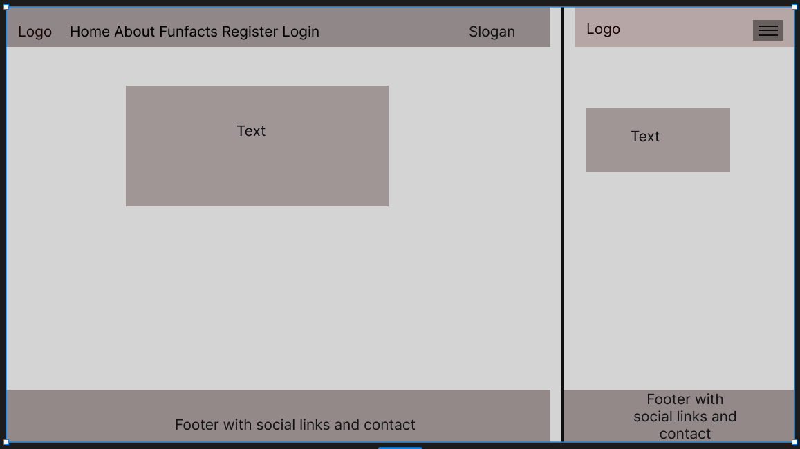

 Blog Page Guest

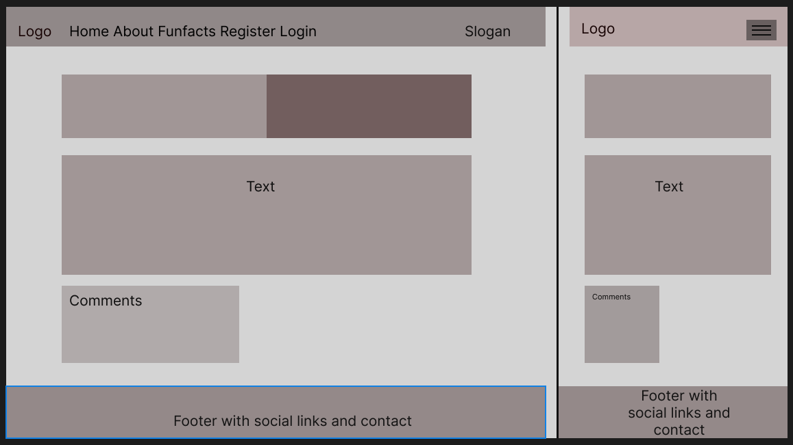

 Blog Page Logged in User

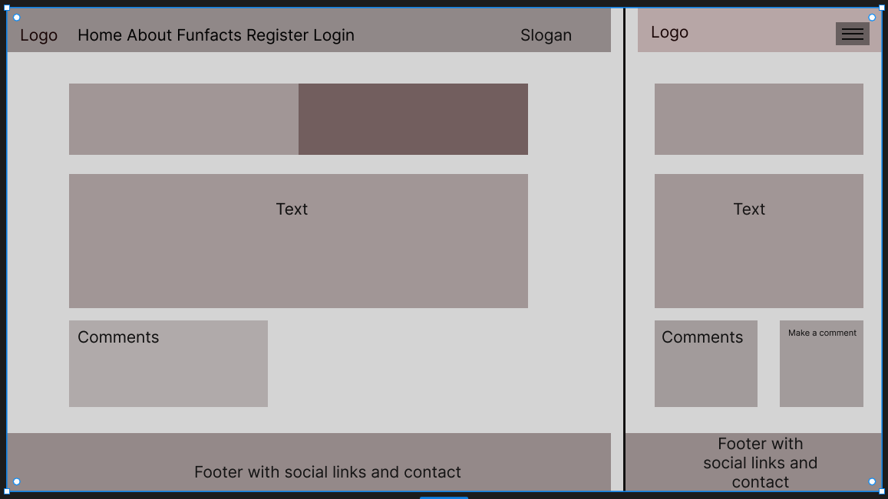

## Database Scheme

### Entity Relationship Diagram (ERD)

 ERD Blog

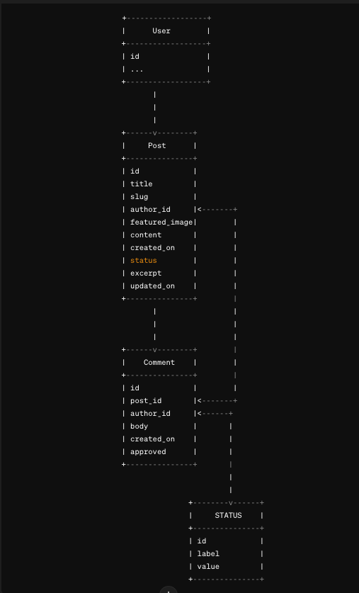

Each box represents a table/entity in the database.
The fields within each box represent the columns/attributes of the corresponding table/entity.
Arrows represent relationships between tables/entities.
Foreign key relationships are indicated by lines connecting the primary key of one table/entity to the corresponding field in another table/entity.

 ERD About

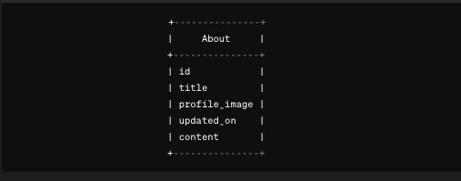

The About model has its own table/entity in the database.
The fields within the About model represent the columns/attributes of the About table/entity.
There are no relationships with other models specified in the provided About model, so no arrows are shown.

 ERD Funfacts

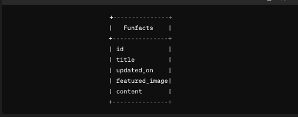

The Funfacts model has its own table/entity in the database.
The fields within the Funfacts model represent the columns/attributes of the Funfacts table/entity.
There are no relationships with other models specified in the provided Funfacts model, so no arrows are shown.

## Security Features

### User Authentication
Screen|Fixed uses Django Allauth authentication and authorization library, which provides a set of features for managing user authentication, registration, and account management.

### CSRF Protection
Django provides built-in protection against Cross-Site Request Forgery (CSRF) attacks. CSRF tokens are generated for each user session, and they are required to submit forms or perform state-changing actions. When a user logs out, the session and associated CSRF token are invalidated, making it difficult for an attacker to forge a valid request using a copied URL.

## Features

### User Registration and Login System
Enable users to create accounts and log in to access their profiles.
Users can post comments, interact with the community, and personalize their experience.

### Blog Post Editor
Empower users to create and publish blog posts discussing movies and series.
The editor offers intuitive formatting options, image and link insertion, and draft saving capabilities.

### Comment Moderation System
Provide the blog owner with tools to moderate comments effectively.
Approve or remove comments as necessary to maintain a respectful and engaging community.

### Funfacts Page
Explore a dedicated funfacts page filled with intriguing trivia about movies and series.
Delve into behind-the-scenes stories, little-known facts, and captivating tidbits that enhance the cinematic experience.

 Home Page

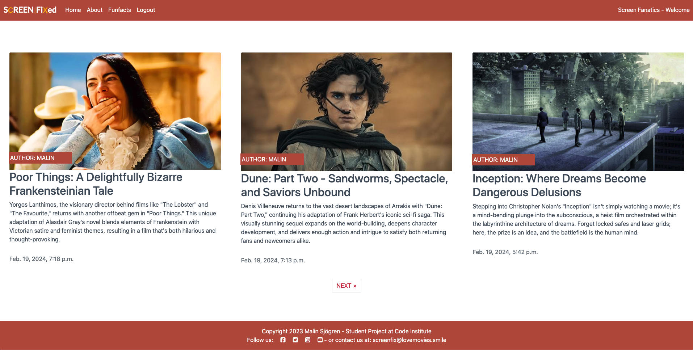

 About page

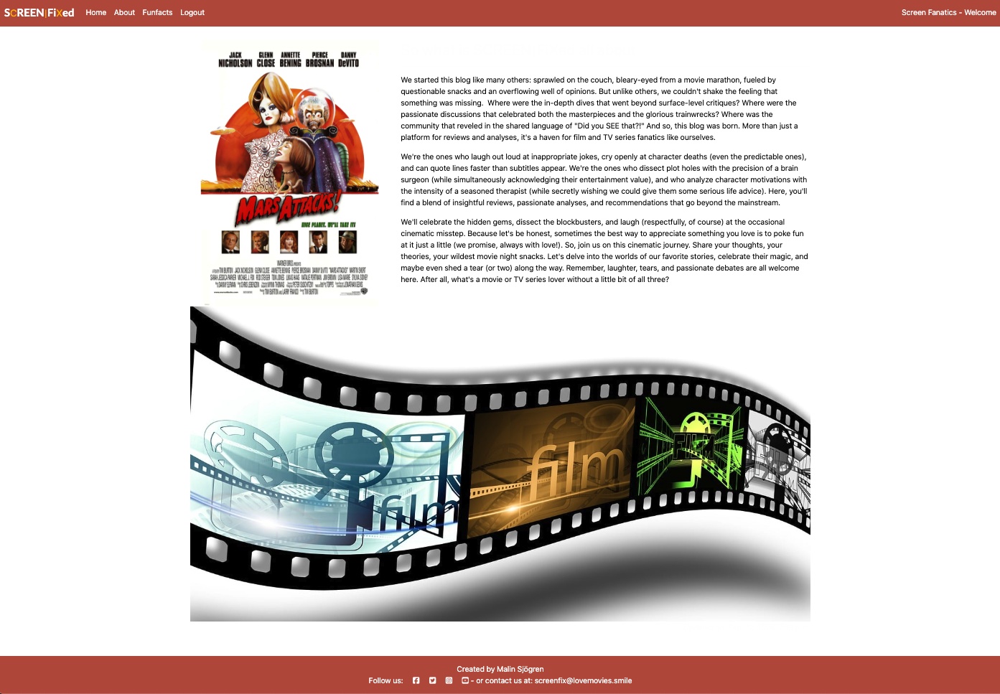

 Funfacts Page

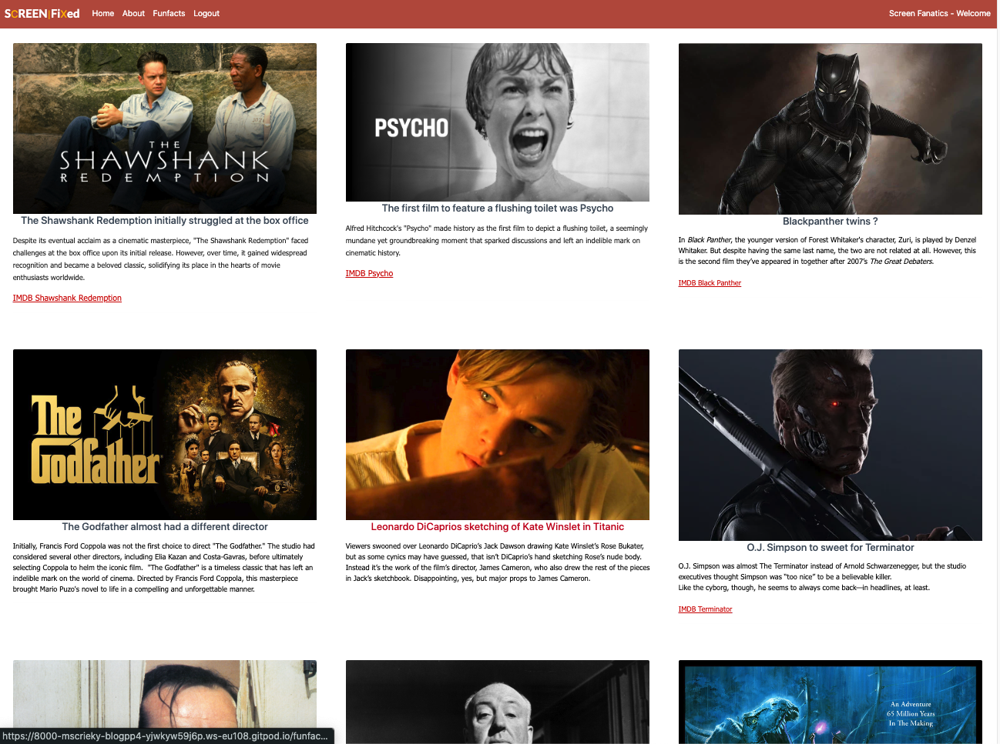

 Log In Page

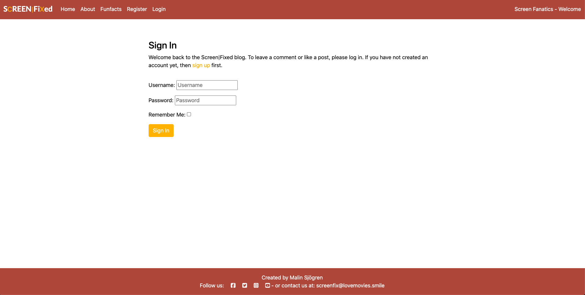

 Register Page

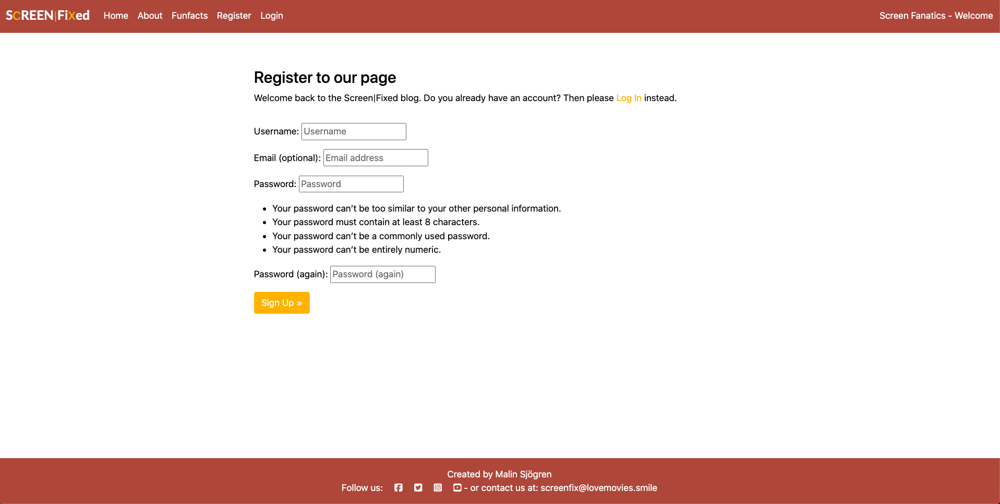

### Features Left to Implement
* StarRating system
* Full text Searchbar

## Technologies Used

### Languages Used

* [HTML5](https://en.wikipedia.org/wiki/HTML5)
* [CSS3](https://en.wikipedia.org/wiki/CSS)
* [JavaScript](https://en.wikipedia.org/wiki/JavaScript)
* [Python](https://en.wikipedia.org/wiki/Python_(programming_language))

### Databases Used

* [ElephantSQL](https://www.elephantsql.com/) - Postgres database
* [Cloudinary](https://cloudinary.com/) - Online static file storage

### Frameworks Used

* [Django](https://www.djangoproject.com/) - Python framework
* [Bootstrap 4.6.1](https://getbootstrap.com/docs/4.6/getting-started/introduction/) - CSS framework

### Programs Used

* [Github](https://github.com/) - Storing the code online
* [Gitpod](https://www.gitpod.io/) - To write the code.
* [Heroku](https://www.heroku.com/) - Used as the cloud-based platform to deploy the site.
* [Google Fonts](https://fonts.google.com/) - Import main font the website.
* [Figma](https://www.figma.com/) - Used to create wireframes and schemes
* [Git](https://git-scm.com/) - Version control
* [Favicon Generator](https://favicon.io/) - Used to create a favicon
* [W3C Markup Validation Service](https://validator.w3.org/) - Used to validate HTML
* [CSS Validation Service](https://jigsaw.w3.org/css-validator/) - Used to validate CSS
* [CI Python Linter](https://pep8ci.herokuapp.com/#) - Used to validate Python

## Deployment
## App Deployment
For deploying Your app, Heroku is used. Follow these steps:

Create a New App:
- Create a new app on Heroku dashboard.

Configure Settings:
- Navigate to "Settings" in new app.

Config Vars Setup:
- In "Config Vars," add PORT as the key and 8000 as its value.

Add PostgreSQL Database:
- Choose PostgreSQL as database.

Example "ElephantSQL" was used in this project

Configure DATABASE_URL:
- In "Config Vars," add DATABASE_URL and copy the URL from PostgreSQL dashboard.

Note: If using ElephantSQL as PostgreSQL provider, you can use the URL provided by ElephantSQL.

Environment Variable Setup:
- Create a new file in workspace called env.py.
- Import the os library and set the environment variable for DATABASE_URL to the Heroku address (or ElephantSQL URL)
- Add a secret key using os.environ["SECRET_KEY"] = "your secret key here".

Heroku Config Vars:
- Add the secret key to the Heroku app's config vars in the settings.

Django Settings:
- In settings.py of Django app, import Path from pathlib, os, and dj_database_url.
- Add if os.path.isfile("env.py"): import env to the file.
- Replace the SECRET_KEY with SECRET_KEY = os.environ.get('SECRET_KEY').
- Replace the database section with DATABASES = {'default': dj_database_url.parse(os.environ.get("DATABASE_URL"))}.

Migrate Models:
- In workspace terminal, migrate the models to the new database connection.

Cloudinary

To integrate Cloudinary into project, follow these steps:

Cloudinary Account:
- Log in to Cloudinary account or create one.

Copy CLOUDINARY_URL:

Environment Variable Setup:

In env.py, add os.environ["CLOUDINARY_URL"] = "add cloudinary_url here".

Heroku Config Vars:
- In Heroku settings, add CLOUDINARY_URL to config vars.

Django Settings:
- In INSTALLED_APPS, add cloudinary_storage, Django.contrib.staticfiles, and cloudinary in this order.
- Configure static file settings in settings.py: URL, storage path, directory path, root path, media URL, and default file storage.
- Templates Directory Link:

Link the file to the templates directory in Heroku with TEMPLATES_DIR = os.path.join(BASE_DIR, 'templates').

Change Templates Directory:
- Change the templates directory to TEMPLATES_DIR - 'DIRS': [TEMPLATES_DIR].

Additional Folders:
- Create three new folders: media, static, and templates.

Procfile Creation:

Create a Procfile.
- Add the following line inside the Procfile: web: gunicorn project_name_here.wsgi.
- Push Changes: - Push all changes to GitHub.

Manual Deployment: - In the Heroku deployment tab, deploy to Heroku manually the first time and closely monitor the process. - Once successful, set up automatic deployments.

Version Control
-  To manage version control and push code to the main repository on GitHub using GitPod, follow these steps:

Add Changes:
- In the GitPod terminal, use the command git add . to stage changes.

Commit Changes:
- Commit changes with a descriptive comment using the command:
- git commit -m "Push comment here"

Push to GitHub:
- Push the updates to the repository on GitHub with the command:
- git push

Migrate Models: - In the terminal, migrate the models to the new database connection.

#### How to Fork
1. Log in(or Sign Up) to Github
2. Go to repository for this project [Screen|Fixed](https://github.com/MsCrieky/Blog_PP4)
3. Click the fork button in the top right corner

#### How to Clone
1. Log in(or Sign Up) to Github
2. Go to repository for this project [Screen|Fixed](hhttps://github.com/MsCrieky/Blog_PP4)
3. Click on the code button, chose whether you would like to clone with HTTPS, SSH or GitHub CLI and copy the visable link.
4. Open the terminal in your code editor and change the current working directory to the location you want to use for the cloned directory.
5. Type the following command in the terminal (after the git clone you will need to paste the link you copied in step 3 above)
6. Set up a virtual environment (this step is not required if you are using the Code Institute Template in GitPod as this will already be set up for you).
7. Install the packages from the requirements.txt file - run Command pip3 install -r requirements.txt

## References
### Docs

* [Stack Overflow](https://stackoverflow.com/)
* [Code Institute](https://learn.codeinstitute.net/dashboard)
* [Bootstrap 4.6](https://getbootstrap.com/docs/4.6/getting-started/introduction/)
* [Django docs](https://docs.djangoproject.com/en/4.2/releases/3.2/)
* [Django Allauth](https://django-allauth.readthedocs.io/en/latest/)
* [Django and Static Assets](https://devcenter.heroku.com/articles/django-assets)
* [Cloudinary](https://cloudinary.com/documentation/diagnosing_error_codes_tutorial)
* [Google](https://www.google.com/)

## Credits

Code

- The README template was helpfully provided by Code Institute (template) as was the main template.
- Slack has been a good platform for inputs and ideas.
- ChatGPT has also been a resource for explaining things to me as a newbie.

Content

- All the text was written by the developer with a little help from ChatGPT.
- Images was taken from IMDB 
- Funfacts information was taken from the page [Facts.net](https://facts.net/) and [Complex.com](https://complex.com/)

## Acknowledgements

- Slack community has been a great resource for help and ideas.
- My mentor Mitko Bachvarov has provided me with good links to helpful websites and gently guided me with good feedback.
- ChatGPT, thanks for the tuition, laughs and correction of text.
- Anna, my inspiration and support. Thank you.