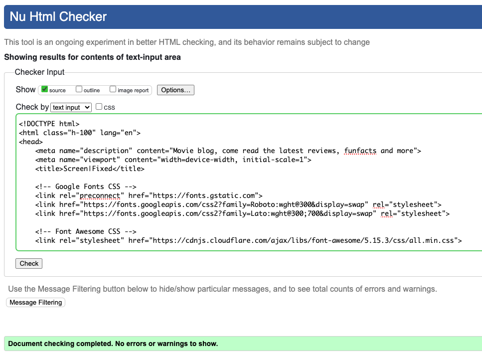
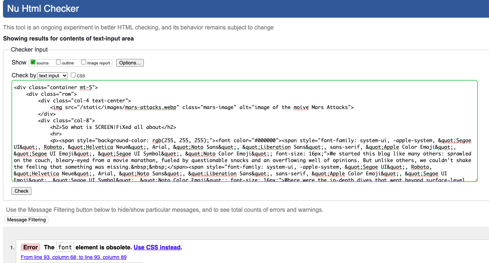
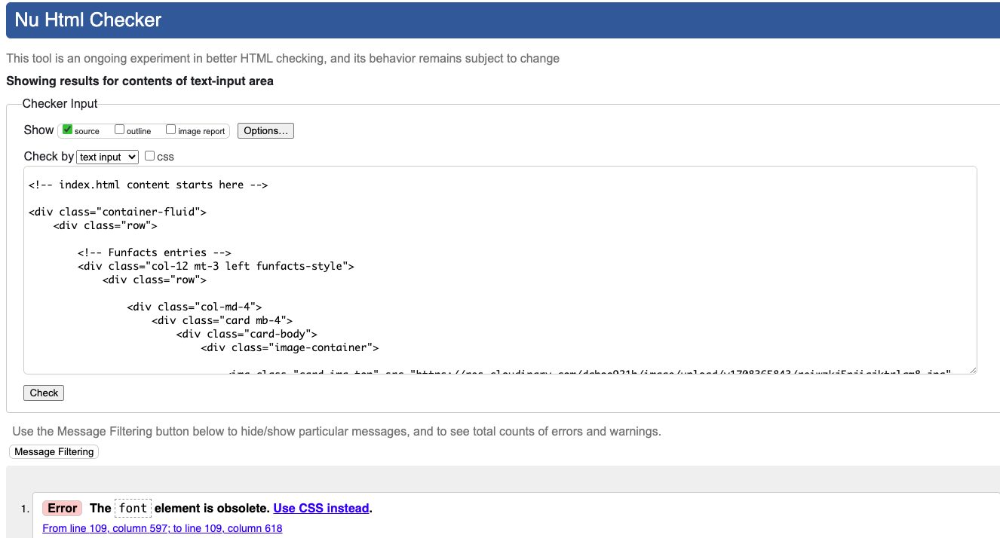
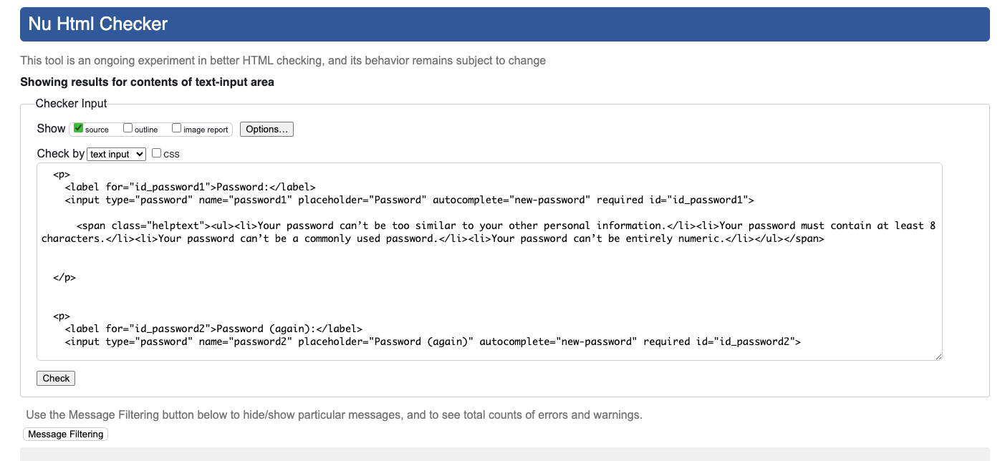
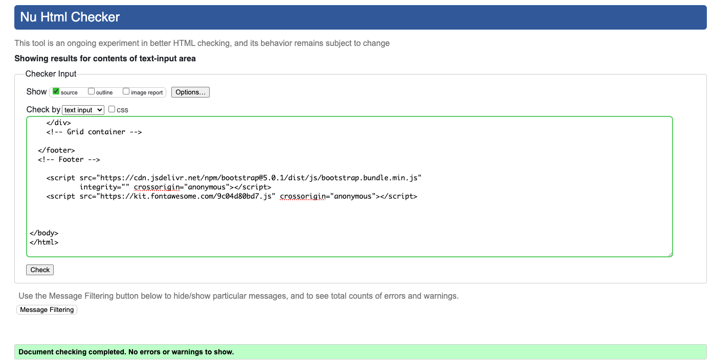
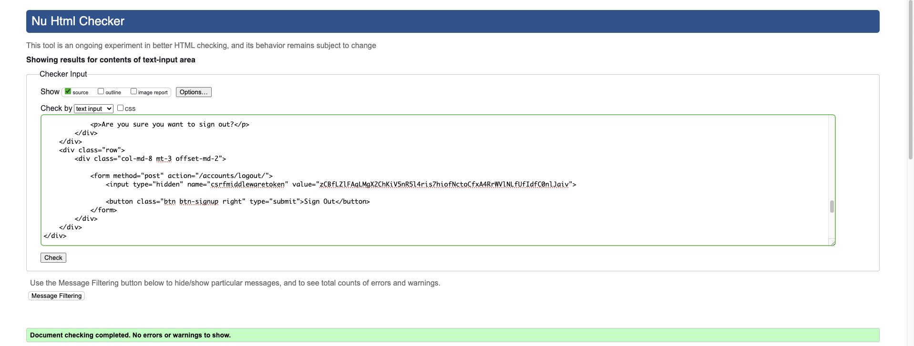

# Screen|Fixed | Testing

Return to [README](README.md)
- - -
Thorough testing has been conducted to guarantee the website operates smoothly and functions optimally.

## Responsiveness Testing

The deployed website underwent extensive testing across various devices and screen sizes to ensure responsiveness and adaptability. Developer Tools were used to simulate diverse screen sizes, facilitating thorough evaluation of the website's behavior across different devices. Bootstrap classes and media queries were integrated to achieve the desired design, ensuring the website maintains its visual and functional integrity across all platforms, thereby enhancing the user experience.

## Code Validation

W3C Markup Validation, offered by W3C, assesses HTML code compliance with official standards, identifying syntax errors and improper tag usage that could affect webpage structure and meaning. Utilizing this service ensures well-structured HTML code aligned with web standards.

The HTML page from web application templates was captured using Google Chrome's 'Inspect' function and validated against the W3C Validator.

In this project, the "Summernote" rich text editor enables users to create and update posts with HTML content, enhancing the user experience but introducing complexities during HTML validation.

User-input HTML may result in unconventional structures or attributes, detected as errors by external tools like the W3C validator.

To maintain application security, safeguards such as the |safe filter are implemented. This filter prevents user-entered HTML from compromising application security.

 Home Page

 About Page

 Funfacts Page

 Signup Page

 Login Page

 Logout Page

## Bugs

### Resolved Bugs

#### Refused to apply style from Screen|Fixed link because its MIME type(text/html).

* When I deployed the site to Heroku, my custom CSS was not working, it was due to Cloudinary not providing my static files, I had to change my DEBUG = True to DEBUG = development, development = os.environ.get('DEVELOPMENT'), which is connected to my Gitpod variable DEVELOPMENT  which is set to True, meaning deployed site is set to False and production is set to True, I had to delete my static files from Cloudinary and force a manual deploy again and it picked up the files and everything works since then.

### Unresolved Bug

#### Error in signup page

* In the html report I got "Error: End tag p implied, but there were open elements" I looked in the actual signup.html but the error was not from there, it is in a form which I can not find. 

## Features Testing

| Page          | Action        | Expected Result  | Outcome          |
|---------------|---------------|------------------|------------------|
| Home Page     |               |                  |                  |
|               | Click on Home (Nav-bar) | Redirect to Home page | PASS |
|               | Click on Register (Nav-bar) | Redirect to Sign Up page | PASS |
|               | Click on About (Nav-bar) | Move to about section | PASS |
|               | Click on social links in footer | Redirect to social platform | PASS |
|               | Click on Funfacts (Nav-bar) | Redirect to Funfacts page | PASS |
|               | Click on Login (Nav-bar) | Redirect to login page | PASS |
|               | Click on blogposts | Redirect to detail page | PASS |
|               | Click on "Next" button  | Redirect to next page | PASS |
| Home Page (Logged In - User)  |                 |          |  |
|               | After Login | Sign Up button is now logout button | PASS |
|               | Make comment in blogpost section | Get "waiting for approval message" | PASS |
|               | After Login | Users name is displayed in navigation bar | PASS |
|               | Click on Edit button | Get to edit previously made comment | PASS |
|               | Click on Delete button for comment | Deletes previously made comment | PASS |
|               | Click on Home (Nav-bar) | Redirect to Home Page | PASS |
|               | Click on About (Nav-bar) | Redirect to about section | PASS |
|               | Click on social links in footer | Open new tab with appropriate link | PASS |
|               | Click on Funfacts (Nav-bar) | Redirect to Contact page | PASS |
|               | Click on Login (Nav-bar) | Redirect to Login page | PASS |
|               | Click on blogposts | Redirect to Blogpost page | PASS |
|               | Click on "Next" button | Redirect to next three Blogposts | PASS |
|               | Click on Funfacts links to imdb | Redirect to individual page on imdb | PASS |
|               | Click on Logout | Redirect to Logout Page | PASS |
| Sign Up Page  |                  |                  |                  |
|               | Enter invalid email | Field will only accept email address format | PASS |
|               | Enter valid email | No error | PASS |
|               | Email field left empty | Email is optional | PASS |
|               | Type invalid password | Must contain atleast 8 char | PASS |
|               | Type valid password | No error | PASS |
|               | Type password again (different) | Password must be the same | PASS |
|               | Click Sign Up with empty form | Fill in the form fields | PASS |
|               | Click Sign In if you have an account | Redirect to Login page | PASS |
|               | Fill all the form fields | Account created, alert message that you Signed in | PASS |
| Login Page  |                  |                  |                  |
|               | Click on Sign Up, if you don't have an account | Redirect to Sign Up page | PASS |
|               | Try invalid username | Username is not correct | PASS |
|               | Try invalid password | Password is not correct | PASS |
|               | Valid password and username | Logs in, message that you signed in | PASS |
|               | Click Sign In with empty form | Fill in the form fields | PASS |
| Logout Page  |                  |                  |                  |
|               | Click on Sign Out button | Sign user out, message that user signed out | PASS |
| Admin Panel |  |    |    |
|               | CRUD functionality | Working as expected | PASS |

Return to [README](README.md)